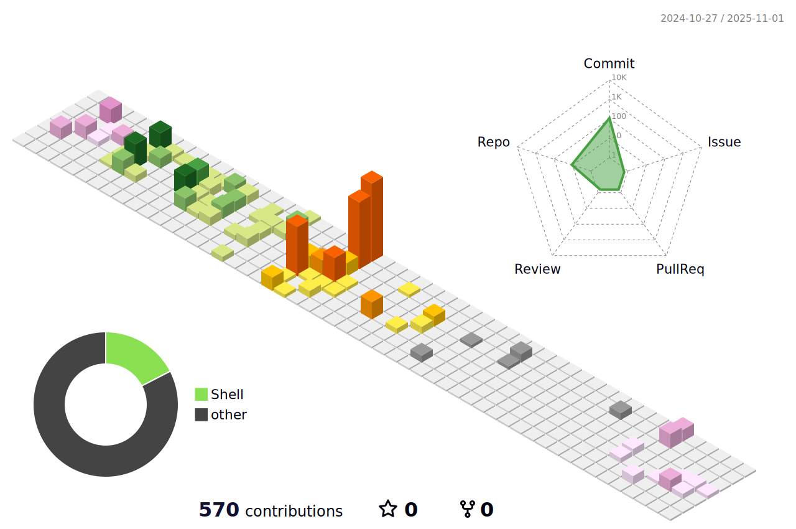

<p align="center">
  
</p>

<p align="center">
  
  [](https://linkedin.com/in/s-kiser)
 <!--
  [](https://facebook.com/s-kiser)
  [](https://freelancer.com/s-kiser)
  [](https://fiverr.com/s-kiser)
  [](https://upwork.com/s-kiser)
  [](https://x.com/s-kiser)
  [](https://instagram.com/s-kiser)
  [](https://threads.com/s-kiser)
  [](https://youtube.com/@s-kiser)
  [](https://medium.com/@s-kiser)
  [](https://dev.to/s-kiser)-->
</p>

</br>

### Top Tools:
<p align="left">
  
  
  
  
  
  
  
  
  
  
  
  
  
  
  
  
</p>

</br>


<!--  -->
<!--  -->

</br>

### Basic Info
```yaml
Summary: I am a DevOps Engineer with 10++ years doing web development.
Name: Stephen Elisha Kiser
Age: 27
Location: Texas
Education: Self Taught, 1997 - present
Favorte Books:
  - "Goodnight Mr Tom"
  - "The Richest Man Who Ever Lived": Steven K Scott
  - "Crispin: The Cross of Lead"
  - "The Redwall Series"
  - "The Dark is Rising Series"
  - "The House of The Scorpion"
  - "The Sea of Trolls"
Fun Fact: I have never been to school a day in my life.
Biggest Accomplishment: Creating an E-Commerce system from scratch.
What is Agile: A set of values and principles, that CAN lead to a mindset.
```

</br>

### Other:
<p>
  
  
  
  
  
  
  
  
  
  
  
  
  
  
  
</p>

</br>

### Hobbies:
<p align="left">
  
  
  
  
  
  
  
  
  
  
</p>

</br>

<!--  -->


<!-- [](https://github.com/anuraghazra/github-readme-stats) -->

<!--
### Linux Favorites:
<p align="left">


</p> 
-->

### Ice-Breaker:
- 🌱 <b>Currently learning:</b> Shopify app development.
- 🔋 <b>What I do for fun:</b> I love to read, listen to podcasts or audiobooks, 3d printing, and grow in entreprenuership.
- 📚 <b>Recent Book Favorites:</b> The Art of the Deal, The 4-Hour Workweek, Atomic-Habits, Thoughts are Things.
- 🎧 <b>Currently listening to:</b> Hillbilly Ellegy.

</br>

### Goals:
- Financial Freedom
- Lauching my SaaS
- Enterprise Chrome Extensions
- College for Literature

</br>
<!--
### Latest from the Blog:
-->

</br>
<!--
### Stats:
<p>
-->
<!--
[](https://git.io/streak-stats) 
</p>
-->

<!--
### Support Me:
<p>
<a href="https://www.buymeacoffee.com/s-kiser" target="_blank"></a>
</p>
-->


<!--

https://github.com/devicons/devicon/blob/master/icons/linkedin/linkedin-original.svg

**s-kiser/s-kiser** is a ✨ _special_ ✨ repository because its `README.md` (this file) appears on your GitHub profile.

Here are some ideas to get you started:

- 🔭 I’m currently working on ...
- 🌱 I’m currently learning ...
- 👯 I’m looking to collaborate on ...
- 🤔 I’m looking for help with ...
- 💬 Ask me about ...
- 📫 How to reach me: ...
- 😄 Pronouns: ...
- ⚡ Fun fact: ...
-->
